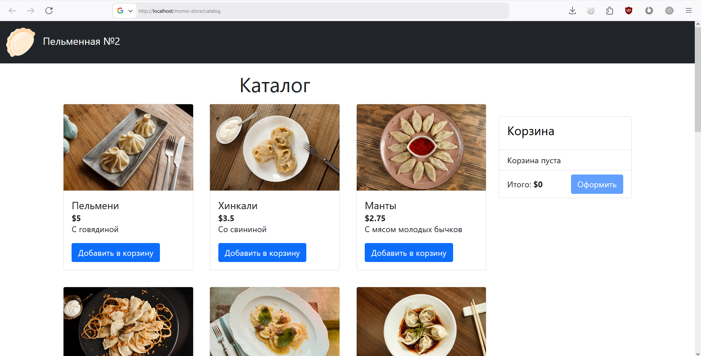

# Проект по дисциплине "Docker-контейнеризация"

## Инфраструктура

Проект состоит из трех образов (контейнеров):
- [backend](./backend/Dockerfile):
    - Go сервер,
    - non-root пользователь `appuser`,
    - порт `8081` (по умолчанию),
    - healthcheck - проверка эндпоинта `/health`,
    - постоянный перезапуск,
    - [.dockerignore](./backend/.dockerignore);
- [frontend](./frontend/Dockerfile):
    - копирование статики в volume,
    - завершение без перезапуска,
    - [.dockerignore](./frontend/.dockerignore);
- [gateway](./nginx/Dockerfile):
    - nginx,
    - non-root пользователь `nginxuser`,
    - отдача статики из volume,
    - хост `localhost`,
    - порт `80` (по умолчанию),
    - зависит от frontend и backend,
    - healthcheck - проверка эндпоинта `/health`,
    - постоянный перезапуск.

Структура docker-compose:
- 3 сервиса (собираются с помощью Dockerfile'ов);
- 2 сети:
    - frontend,
    - backend (внутренняя);
- 1 volume - для статики с frontend.

Файлы для docker-compose:
- [docker-compose.yml](./docker-compose.yml) - для разработки;
- [docker-compose.prod.yml](./docker-compose.prod.yml) - для продакшен-среды;
- [docker-compose.override.yml](./docker-compose.override.yml) - перегрузка конфигураций для удобства разработки.

## Конфигурация контейнеров и сервисов

Для гибкости конфигурации контейнеров введены следующие переменные:
- APP_VERSION,
- GO_VERSION,
- NODE_VERSION.

Для конфигурирования сервисов используются переменные окружения, описанные в следующих файлах:
- [.env.example](./.env.example),
- [.env.prod.example](./.env.prod.example).

> [!NOTE]
> Чтобы избежать усложнения структуры и сохранить прозрачность, был введен минимум переменных.
> При необходимости во время развития проекта можно добавлять переменные, например, для backend-приложения.

## Оптимизация размера образов

### Оптимизации образов

### Итоговые размеры образов

|Образ|Размер, МБ|Объяснение|
|:---|:---|:---|
|docker-project-backend|`16.8`|alpine (7.4 МБ) + appuser, appgroup (4.71 КБ) + собранное приложение (9.41 МБ)|
|docker-project-frontend|`9.11`|alpine (7.4 МБ) + статика (1.71 МБ)|
|docker-project-gateway|`41.0`|nginx (~40 МБ) + настройки (~1 МБ)|

## Масштабируемость и устойчивость приложения

Backend-приложение может быть горизонтально масштабировано с использованеим реплик сервиса в docker-compose, количество реплик при деплое настраивается в .env - `BACKEND_REPLICA_COUNT`.
Балансировка обеспечивается сервисом gateway (nginx), в котором настроен динамический подбор реплики для обработки запроса.

## Безопасность контейнеров

Безопасность контейнеров обеспечена
- запуском контейнеров без root,
- использованием capabilities,
- лимиты памяти и CPU,
- временной файловой системой,
- использованием базовых образов с минимальным количеством уязвимостей,
- сканированием Trivy в рамках workflow.

## Управление секретами

В проекте используются секреты GitHub Actions, .env файлы.
Чувствительной информации в образах нет. 

## Результаты

Результат выполнения команды `docker-compose up -d`:

